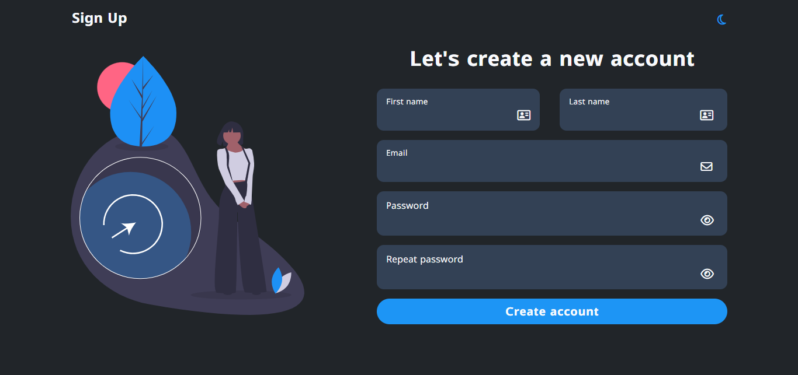

# Sign-up page
Essa é uma simples página de cadastro, mas que utiliza diversas tecnologias modernas como TypeScript, HTML e Tailwind CSS para fornecer uma experiência agradável ao usuário. A página permite que os usuários criem uma nova conta fornecendo seu nome, sobrenome, e-mail e senha. O design é elegante e intuitivo, além disso, a página inclui validações de entrada de formulário para uma melhor experiência do usuário.
 
 

# Recursos
A página possui os seguintes recursos:
- Fontes: A página usa a família de fontes "Lunasima" do Google Fonts. Acrescenta um toque moderno e elegante aos elementos de texto.

- Ícones do Font Awesome: A página utiliza ícones do Font Awesome para aprimorar a interface do usuário. Ele adiciona elementos visuais como ícones de sol e lua para alternância de temas e ícones de olho para visibilidade de senha.

- Tailwind CSS: a página é estilizada usando o Tailwind CSS, uma estrutura CSS baseada em utilitários que permite um desenvolvimento rápido e um design consistente.

- SweetAlert2: O projeto usa SweetAlert2, uma biblioteca pop-up bonita, responsiva, personalizável e acessível, para exibir mensagens de sucesso e erro aos usuários.

- Validador: o validador é usado para executar a validação de e-mail para garantir que os usuários insiram um endereço de e-mail válido durante a inscrição.

# Design e Funcionalidade
A página apresenta as seguintes características relacionadas ao design e funcionalidades:
- Design Responsivo: A página é projetada para ser responsiva e ajusta seu layout com base no tamanho da tela do dispositivo do usuário, garantindo uma experiência consistente em diferentes dispositivos.

- Modo escuro: a página inclui um recurso de modo escuro, permitindo que os usuários alternem entre temas claros e escuros com um simples clique no ícone de sol/lua no cabeçalho.

- Alternância de visibilidade de senha: Os campos de entrada de senha têm um ícone de olho que alterna a visibilidade de senha, tornando mais fácil para os usuários verem suas senhas inseridas.

- Validação de entrada de formulário: a página valida a entrada do usuário. Se algum campo obrigatório for deixado em branco ou se os campos de e-mail e senha não atenderem ao formato exigido, mensagens de erro serão exibidas para solicitar que o usuário corrija a entrada.

- Mensagem de sucesso: após o envio bem-sucedido do formulário, uma mensagem de sucesso aparece para informar aos usuários que sua conta foi criada com sucesso.
