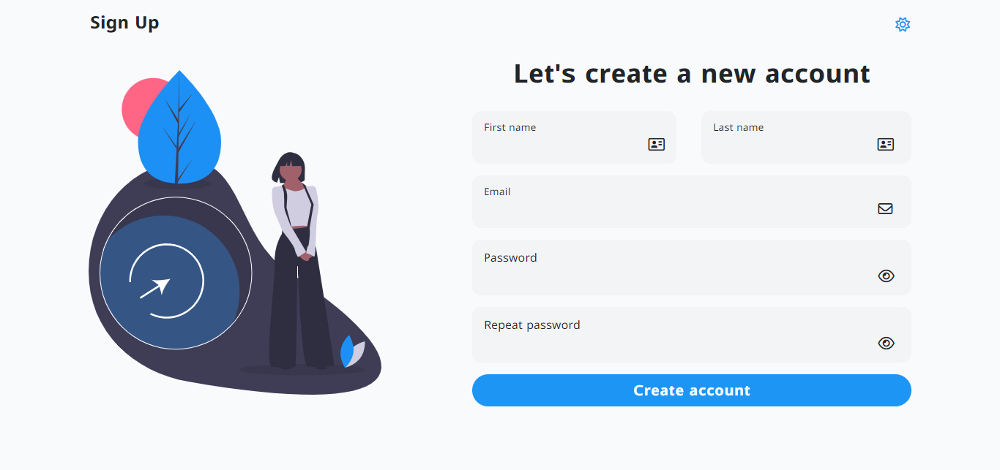

# Sign-up page
Essa é uma simples página de cadastro, mas que utiliza diversas tecnologias modernas como TypeScript, HTML e Tailwind CSS para fornecer uma experiência agradável ao usuário. A página permite que os usuários criem uma nova conta fornecendo seu nome, sobrenome, e-mail e senha. O design é elegante e intuitivo, além disso, a página possui validações de entrada de formulário para uma melhor experiência do usuário.
<br>
<br>



# Design e Funcionalidade
A página apresenta as seguintes características relacionadas ao design e funcionalidades:
- **Fontes:** A página usa a família de fontes "Lunasima" do Google Fonts. Acrescenta um toque moderno e elegante aos elementos de texto.

- **Ícones do Font Awesome:** A página utiliza ícones do Font Awesome para aprimorar a interface do usuário. Ele adiciona elementos visuais como ícones de sol e lua para alternância de temas e ícones de olho para visibilidade de senha.

- **Design Responsivo:** A página é projetada para ser responsiva e ajusta seu layout com base no tamanho da tela do dispositivo do usuário, garantindo uma experiência consistente em diferentes dispositivos.

- **Modo escuro:** a página inclui um recurso de modo escuro, permitindo que os usuários alternem entre temas claros e escuros com um simples clique no ícone de sol/lua no cabeçalho.

- **Alternância de visibilidade de senha:** Os campos de entrada de senha têm um ícone de olho que alterna a visibilidade de senha, tornando mais fácil para os usuários verem suas senhas inseridas.

- **Validação de entrada de formulário:** a página valida a entrada do usuário. Se algum campo obrigatório for deixado em branco ou se os campos de e-mail e senha não atenderem ao formato exigido, mensagens de erro serão exibidas para solicitar que o usuário corrija a entrada.

- **Mensagem de sucesso:** após o envio bem-sucedido do formulário, uma mensagem de sucesso aparece para informar aos usuários que sua conta foi criada com sucesso.

# Tecnologias
As tecnologias utilizadas neste projeto foram:

- **HTML:** A linguagem de marcação padrão para a estruturação do conteúdo da página.

- **TypeScript:** A linguagem de programação que adiciona tipagem estática ao JavaScript.

- **Tailwind CSS:** O framework CSS utilizado para estilizar a página de forma rápida e eficiente.

- **Webpack:** Uma ferramenta essencial para empacotar e otimizar os recursos do projeto. Ele permitiu agrupar os arquivos JavaScript em bundles e com o uso de loaders e plugins, é possível transformar e otimizar o código, tornando-o mais leve e eficiente para o navegador.
  
- **SweetAlert2:** Uma biblioteca JavaScript para exibir modais e mensagens personalizadas, aprimorando a experiência do usuário fornecendo mensagens de erro e sucesso visualmente agradáveis após a validação do formulário..

- **Validator.js:** Uma biblioteca JavaScript para validar dados, neste projeto, foi responsável por garantir que o e-mail inserido pelo usuário seja válido, reduzindo potenciais problemas com dados inválidos.

# Utilização
Para usar esse projeto na sua máquina local siga estas etapas:
- Certifique-se de ter o Node.js e o npm instalados em sua máquina.
- Clone o repositório para sua máquina local utilizando o seguinte comando:
```bash
  git clone https://github.com/ViniciusQuintas/weather-app.git
```
- Após clonar o repositório, navegue até o diretório do app no terminal:
```bash
  cd weather-app
```
- Instale todas as dependências do projeto listadas no arquivo `package.json` com o seguinte comando:
```bash
  npm install
```
- Após a instalação das dependências, execute o seguinte comando para compilar o código TypeScript e criar os arquivos JavaScript minificados na pasta `src`.
```bash
  npm run build
```
